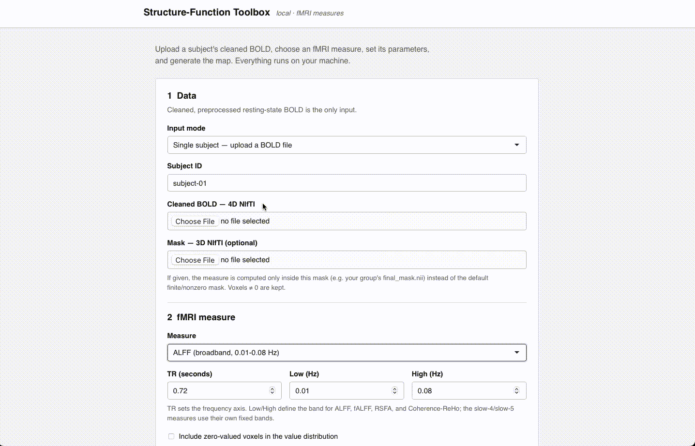
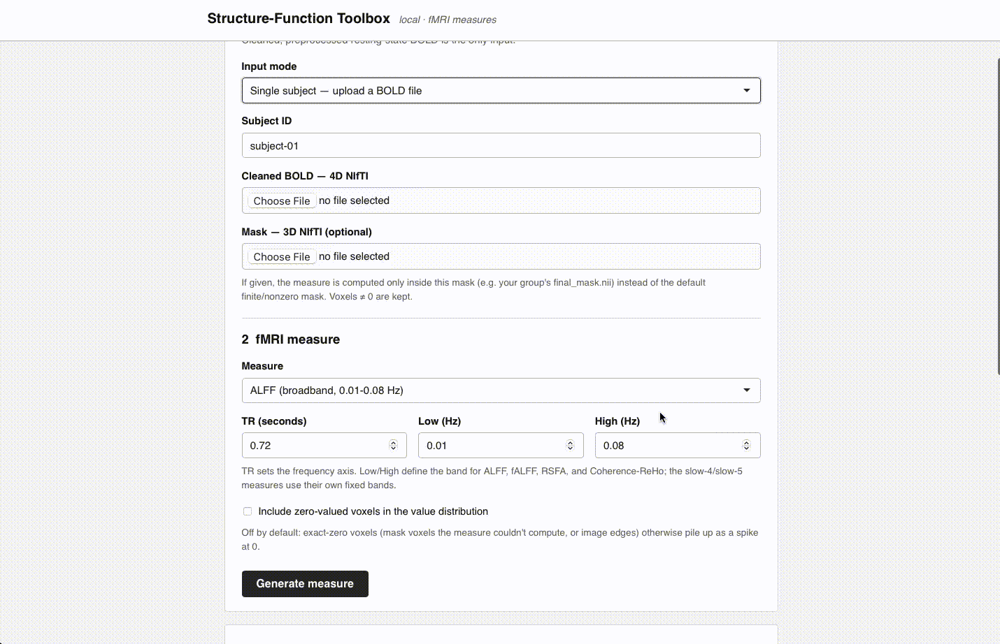

# structure_function_toolbox

Compare **structural** (FA-based) and **functional** (resting-state fMRI)
connectivity in the same brain, and benchmark any subject against an **HCP
normative cohort**. Our niche: using **fractional anisotropy (FA)** as the
structural signal (with T1 intensity and white-matter fMRI as planned
extensions), rather than raw streamline counts.

The toolbox does **not** preprocess. It consumes already-preprocessed data
that conforms to [`docs/input_spec.md`](docs/input_spec.md), computes measures,
and compares.

## What it looks like

A small local web app (nothing leaves your machine) walks you from an uploaded
subject to a measure map, a value distribution, and a comparison against the
group average.

**1. Choose your data**



**2. Choose a measure**



**3. View the results**


Try it without any data using the built-in demo:

```bash
pip install -e .
python -m sftoolbox.webapp     # opens http://127.0.0.1:5000
```

Then click any **Run demo** button to compute a measure on synthetic BOLD.

## How it works

Every subject, HCP or a user's own, runs through the *same* extraction path:

0. **Voxelwise fMRI measures**: frequency-based (ALFF/fALFF, broadband and
   slow-4/slow-5), local-synchrony (ReHo, Coherence-ReHo, RSFA, INT), and entropy
   (MSE). Vendored verbatim from the team's DPABI-matched DCC pipeline in
   `sftoolbox/fmri_measures.py` and `sftoolbox/fmri_measures_extra.py`, so the
   toolbox computes them exactly as the team does; `sftoolbox/measures.py` is a
   thin adapter over them.
1. **Functional connectivity** from cleaned rs-fMRI (`sftoolbox/fmri.py`)
2. **FA-weighted structural connectivity** from diffusion (`sftoolbox/fa.py`)
3. **Structure-function coupling** metric (`sftoolbox/coupling.py`)

Then:

4. **Normative reference**: run all HCP subjects, store the coupling
   distribution (`sftoolbox/reference.py`). This saved reference is the
   redistributable "standard dataset".
5. **Compare**: a new user subject → same path → z-score / percentile vs. the
   HCP distribution (`sftoolbox/compare.py`).

## Status

Implemented and verified: coupling metrics, normative reference, comparison,
NIfTI/atlas loading + conformance checks, and the full functional (fMRI) path.
FA computation (`fa.compute_fa_map`, dipy tensor fit) and FA-weighted structural
connectivity (`fa.fa_weighted_connectivity`, mean FA along streamlines per
region pair) are implemented against dipy's API; run them locally where dipy is
installed. Still to confirm: the `[decide]` items in the input spec (atlas,
exact cleaning level, structural edge definition).

## Local web app

A small local server with an upload-and-compare interface (opens in your
browser; nothing leaves your machine):

```bash
pip install -e .                 # includes flask, matplotlib, dipy
python -m sftoolbox.webapp       # opens http://127.0.0.1:5000
```

Upload a subject's atlas + BOLD (and optionally an FA map + tractogram) to
generate connectivity, coupling, and the cohort comparison. Click **Run demo**
to see the whole flow on synthetic data first.

The **FA** panel takes a precomputed FA map (and an optional atlas for regional
FA) and exposes an **FA-threshold slider**: voxels below the threshold are
treated as non-white-matter and excluded. Drag the slider on the results page to
re-threshold without re-uploading (0.20 is the conventional white-matter cutoff).

**Cohort de-identification.** A folder (batch) upload reports *group-level*
results only: the group-average map, its statistics, and the subject count.
Individual subject maps and per-subject statistics are intentionally withheld
(the per-subject views and downloads are disabled).

The compare panel uses a saved HCP reference at `outputs/hcp_reference.npz`
(auto-loaded if present). Build it once:

```bash
# real HCP data (one subfolder per subject):
python scripts/build_reference.py --subjects-root /path/to/HCP \
       --atlas /path/to/atlas_labels.nii.gz --out outputs/hcp_reference.npz
# or a placeholder before you have data:
python scripts/build_reference.py --synthetic --out outputs/hcp_reference.npz
```

## Normative references

Most toolboxes can compute a measure. Far fewer can tell you whether *one*
person's map is unusual, because that needs a normative cohort, and assembling
one is the expensive part. This toolbox ships pre-built references so a single
subject can be compared out of the box, with no cohort of your own.

Each reference is a `.npz` holding, for one measure, the voxelwise **mean** and
**standard deviation** across the cohort, plus the mask, the cohort size, and
its own provenance.

### Getting them

The files are ~15 MB each, so they are published as a
[release](https://github.com/tina-ytyuan/structure_function_toolbox/releases/tag/refs-v1)
rather than committed. Fetch them with:

```bash
python scripts/fetch_references.py            # all 11, verified by SHA-256
python scripts/fetch_references.py rsfa reho  # or just the ones you need
```

That writes `outputs/measure_ref_<measure>.npz`, where the app looks for them
automatically. You can also download them by hand from the release page and
drop them in `outputs/` yourself.

Without them the toolbox still computes every measure; you just get no
comparison panel.

### How the shipped references were built


|               |                                                                        |
| ------------- | ---------------------------------------------------------------------- |
| Source        | Human Connectome Project Young Adult, 936 subjects                     |
| Runs          | Rest1LR, Rest1RL, Rest2LR, Rest2RL (3,744 maps)                        |
| Run handling  | Each run is a separate observation                                    |
| Normalisation | Global in-mask mean (DPABI*m* convention)                              |
| Mask          | `final_mask_no_ventricles.nii`, 226,304 voxels, MNI 2 mm (91×109×91) |
| SD            | Sample SD, N−1 denominator                                            |
| `n` stored    | 936, the number of people, not the 3,744 maps                          |

**Global normalisation.** Amplitude measures (ALFF, RSFA) are in arbitrary BOLD
units, so scanner gain differs between subjects with no biological meaning.
Aggregating raw maps lets that scaling dominate the cohort SD, which inflates
the denominator of the t-test and crushes every *t*. Measured on HCP RSFA, a
raw-unit reference produced **0.12×** as many p<0.05 voxels as chance, fewer
than noise, and a uniform whole-brain offset instead of regional effects.
Normalising each map by its own in-mask mean first fixes this (Zang et al. 2007;
Zuo et al. 2010).

**Runs kept separate.** A reference must describe the same quantity the subject
supplies. Users upload one run, so the SD should describe *single-run*
variability. Averaging each subject's four runs first describes a quieter
quantity and makes ordinary subjects look abnormal, at **1.88×** chance on HCP
RSFA. Keeping runs separate gives **0.99×**. `n` is still the number of people,
so the t-test's degrees of freedom don't treat four runs from one person as
four independent subjects.

### Calibration

A reference is well calibrated when a typical held-out subject looks
unremarkable. Two quantities have known expected values: the SD of *t* across
voxels (1.0) and the ratio of p<0.05 voxels to chance (1.0):


| measure    | SD(t) | obs/chance |  | measure        | SD(t)    | obs/chance |
| ---------- | ----- | ---------- | - | -------------- | -------- | ---------- |
| rsfa       | 1.04  | 0.99       |  | falff_slow4    | 1.01     | 0.94       |
| alff       | 1.04  | 0.97       |  | falff_slow5    | 1.02     | 0.88       |
| falff      | 1.03  | 0.96       |  | int            | 0.98     | 0.80       |
| alff_slow4 | 1.01  | 0.90       |  | coherence_reho | 0.98     | 0.82       |
| alff_slow5 | 1.03  | 0.97       |  | mse            | 0.88     | 0.60       |
|            |       |            |  | **reho**       | **0.85** | **0.32**   |

**Known limitation:** ReHo is conservative. It is Kendall's *W*, bounded on
[0, 1] and typically left-skewed, while the Crawford & Howell t-test assumes a
normal control distribution. The bounded measures degrade in order of how far
they depart from normality. This under-declares significance, the safe
direction, but ReHo findings should be read as conservative, and a
variance-stabilising transform would be the standard remedy.

Verify any reference yourself:

```bash
python scripts/check_reference_calibration.py \
    --ref outputs/measure_ref_rsfa.npz \
    --maps '/path/to/per_subject/*/*/*_rsfa.nii.gz' \
    --mask /path/to/final_mask_no_ventricles.nii --n 20
```

### Building your own

From per-subject measure maps you already have (nothing is recomputed):

```bash
python scripts/reference_from_subject_maps.py --measure rsfa \
    --maps '/path/to/maps/*/*/*_rsfa.nii.gz' \
    --mask /path/to/mask.nii \
    --subjects cohort_ids.txt \
    --out outputs/measure_ref_rsfa.npz
```

`--subjects` pins the cohort so a reference is reproducible rather than
depending on whatever is on disk. `--runs average` reverts to run-averaging if
your subjects supply multi-run averages too.

Subjects do not need to be on the reference's exact voxel grid. Standard space
is not a single grid, so a map on a different MNI resolution is resampled onto
the cohort grid automatically and the results page says so. Only the measure
map is resampled, never the BOLD, which leaves the time series untouched. For
ReHo and coherence-ReHo the comparison is approximate when resolutions differ,
since those summarise a fixed neighbourhood and so depend on voxel size.

### Publishing a reference

Almost everything in a reference is aggregate. Two fields are not:
`subject_ids` records cohort membership and `summaries` holds one value per
subject when populated. Strip them before distribution:

```bash
python scripts/strip_reference_ids.py --refs 'outputs/measure_ref_*.npz' \
    --out-dir outputs/publish
python scripts/strip_reference_ids.py --verify outputs/publish
```

The maps are unchanged and the copies work identically; membership is only
needed to rebuild a byte-identical reference, not to use one. This matters
because HCP places family structure behind Restricted Access, so a membership
list combined with a relatedness-based selection criterion could say something
about the subjects who were left out.

## Test data

No HCP download needed to try the app; `nilearn` fetches real resting-state
BOLD for you:

```bash
python examples/fetch_test_data.py     # ADHD resting-state, 1 subject
# prints a path to a 4D NIfTI; upload it in the app's "Cleaned BOLD" field
```

## Try it end-to-end

```bash
python check.py                        # all logic, no data, no network
python examples/run_subject.py --synthetic   # functional path on synthetic NIfTIs
# real subject (needs dipy + a tractogram + an atlas label volume):
python examples/run_subject.py --subject-dir /path/to/HCP/100307 \
       --id 100307 --atlas /path/to/atlas_labels.nii.gz
```

## Two decisions to lock first

- **Atlas / parcellation**: fixes matrix size and node correspondence.
- **Coupling metric**: `global_corr` vs. `regional_corr`; defines what
  "structure and function aligning" means.

Both live in `sftoolbox/config.py`.

## Quick start

```bash
pip install -e .            # or: pip install -r requirements.txt
pytest                      # runs the coupling + comparison tests
```

## Development

Formatting and linting use **ruff** (configured in `pyproject.toml`). Install
the dev tools and run:

```bash
pip install -e ".[dev]"     # ruff + pytest
ruff format .               # auto-format all code (consistent style)
ruff check .                # lint: unused imports/vars, import order, etc.
ruff check --fix .          # apply the safe lint fixes automatically
```

Lint is scoped to real problems (pyflakes, import sorting, pyupgrade, bugbear);
whitespace and line length are left to `ruff format`. Run `ruff format .` before
committing so diffs stay clean across the team. Note that the first
`ruff format .` will reflow the existing compact style, so preview it with
`ruff format --diff .` if you want to see the changes first.

## Layout

```
src/sftoolbox/   package (config, io, fmri, fa, coupling, reference, compare, pipeline, cli)
scripts/         build_reference.py, compare_subject.py
docs/            input_spec.md  <- the input contract
tests/           synthetic-data tests for the settled logic
```

## Acknowledgements

- The voxelwise fMRI-measure implementations (`fmri_measures.py`,
  `fmri_measures_extra.py`) were developed by the research team and are vendored
  here verbatim so the toolbox reproduces the team's pipeline exactly.
- ALFF/fALFF and ReHo follow the conventions of
  [DPABI](http://rfmri.org/dpabi) / [REST](http://restfmri.net); INT follows
  Watanabe et al. (2019); MSE uses multiscale sample entropy.
- Data were provided [in part] by the **Human Connectome Project**, WU-Minn
  Consortium (Principal Investigators: David Van Essen and Kamil Ugurbil;
  1U54MH091657) funded by the 16 NIH Institutes and Centers that support the NIH
  Blueprint for Neuroscience Research, and by the McDonnell Center for Systems
  Neuroscience at Washington University.
- Built on [NumPy](https://numpy.org), [SciPy](https://scipy.org),
  [nibabel](https://nipy.org/nibabel/), [nilearn](https://nilearn.github.io),
  [DIPY](https://dipy.org), [antropy](https://github.com/raphaelvallat/antropy),
  [matplotlib](https://matplotlib.org), and [Flask](https://flask.palletsprojects.com).

## License

Released under the [MIT License](LICENSE).
